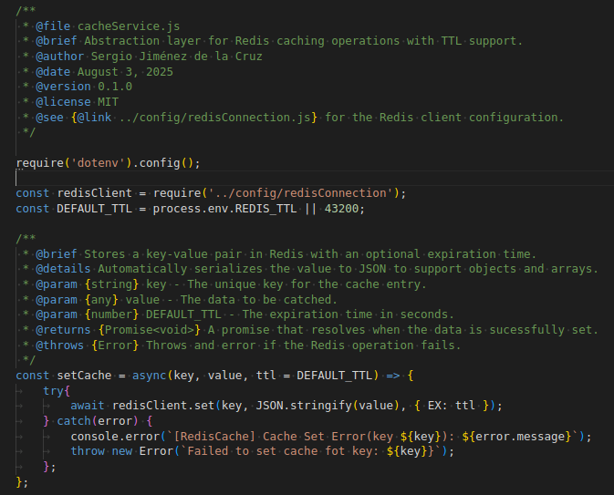
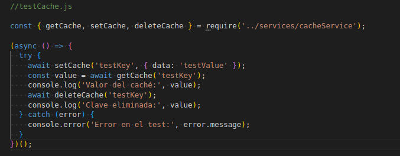

# Weather API

Este proyecto implementa una API REST que proporciona datos meteorológicos utilizando una API de terceros (Visual Crossing) con caché Redis para optimizar el rendimiento.

La API está diseñada para manejar solicitudes de información meteorológica basadas en códigos de ciudad, incorporando características como manejo de errores, limitación de tasas de solicitudes y uso de variables de entorno para seguridad y flexibilidad.

Diseñado como un ejemplo demostrable, muestra habilidades en desarrollo Node.js, integración de APIs, gestión de caché y buenas prácticas de desarrollo.

### Conceptos de aprendizaje

- Integración profesional con APIs de terceros.
- Implementación de sistemas de caché eficientes.
- Gestión segura de variables de entorno.
- Diseño de APIs RESTful escalables.
- Manejo robusto de errores.
- Implementación de medidas de seguridad (rate limiting).
- Arquitectura de software modular.

### Características clave

- **Caché inteligente**: Redis con expiración automática (12h).
- **Seguridad robusta**: Rate limiting y protección de claves API.
- **Manejo de errores detallado**: Respuestas claras para diferentes escenarios.
- **Arquitectura modular**: Código organizado por responsabilidades.
- **Configuración flexible**: Variables de entorno para todos los parámetros sensibles.

### Tecnologías utilizadas

- **Node.js**: Entorno de ejecución principal.
- **Express**: Framework para la API REST.
- **Redis**: Sistema de caché en memoria.
- **Axios**: Cliente HTTP para llamadas API.
- **Dotenv**: Gestión de variables de entorno.
- **Express Rate Limit**: Middleware para limitación de peticiones.

### Estructura del proyecto

```text
/weather-api
├── src/
│   ├── config/          # Configuración
│   │   └── redis.js     # Conexión Redis
│   ├── controllers/     # Lógica de controladores
│   │   └── weatherController.js
│   ├── middlewares/     # Middlewares
│   │   ├── errorHandler.js
│   │   └── rateLimiter.js
│   ├── routes/          # Definición de rutas
│   │   └── weatherRoutes.js
│   ├── services/        # Servicios de negocio
│   │   ├── weatherService.js
│   │   └── cacheService.js
│   └── app.js           # Punto de entrada
├── .env                 # Variables de entorno
├── .gitignore
├── package.json
└── README.md
```

## Fase 1: Configuración inicial

Un proyecto **Node.js** es una aplicación o programa que se ejecuta con el motor de **JavaScript** del lado del servidor.

**Node.js** utiliza un archivo llamado `package.json` que es el corazón del proyecto: define su nombre, versión, scripts, dependencias, etc.

### Crear proyecto Node.js

- `npm init -y` para inicializar el proyecto.

`npm init` te guía por una serie de preguntas (nombre del proyecto, versión, autor, etc.) para crear el archivo package.json.

La opción `-y` (yes) acepta todas las opciones por defecto automáticamente.

Genera un archivo package.json con la siguiente estructura:

```json
{
  "name": "wheather-api",
  "version": "1.0.0",
  "description": "Este proyecto implementa una API REST que proporciona datos meteorológicos utilizando una API de terceros (Visual Crossing) con caché Redis para optimizar el rendimiento.",
  "main": "index.js",
  "scripts": {
    "test": "echo \"Error: no test specified\" && exit 1"
  },
  "keywords": [],
  "author": "",
  "license": "ISC"
}

```

- Crear estructura de carpetas del proyecto.

```text
weather-api/
├── src/
│   ├── config/         # Carga de configuración y conexión a Redis.
│   ├── controllers/    # Lógica al recibir las peticiones.
│   ├── middlewares/    # Middlewares reutilizables.
│   ├── routes/         # Definición de las rutas de las API.
│   ├── services/       # Código que interactua con APIs externas.
│   └── app.js          # Archivo principal
├── .env                # Variables de entorno.
├── .gitignore          
└── package.json        # Gestión del proyecto y dependencias.
```

### Instalar dependencias principales

- Express, axios, dotenv y nodemon.

`npm install express axios dotenv`

| Paquete | ¿Para qué sirve? |
| --------- | -------------- |
| `express` | Framework minimalista para construir la API REST. Facilita la creación de rutas, middlewares y manejo de peticiones/respuestas. |
| `axios`   | Cliente HTTP para hacer peticiones a APIs externas (como Visual Crossing). Es más fácil de usar que `fetch` en Node.js.         |
| `dotenv`  | Permite usar variables de entorno definidas en un archivo `.env`, manteniendo las claves sensibles fuera del código.            |

`npm install -D nodemon`

`nodemon` es una herramienta de desarrollo que reinicia automáticamente tu servidor cuando detecta cambios en los archivos.

Solo se usa durante el desarrollo, por eso se instala con la opción `-D` o `--save-dev`.

- Configurar scripts en package.json

```json
"scripts": {
  "start": "node src/app.js",
  "dev": "nodemon src/app.js"
}
```

| Script | ¿Qué hace?|
| --- | --- |
| `npm start`   | Ejecuta el servidor con Node (modo producción).                                                 |
| `npm run dev` | Ejecuta el servidor con `nodemon` para desarrollo, reiniciando en caliente al detectar cambios. |

### Configurar variables de entorno

Son valores que tu aplicación puede leer desde el entorno del sistema o desde un archivo `.env`, y te permiten:
- Mantener claves privadas fuera del código fuente.
- Cambiar configuraciones fácilmente según el entorno (desarrollo, producción, etc.).
- Evitar errores por hardcodear valores en distintos archivos.

```.env.example
# Puerto del servidor
PORT=

# Clave API de Visual Crossing
VISUAL_CROSSING_API_KEY=

# URL de conexión a Redis
REDIS_URL=

# Configuración de caché (segundos)
CACHE_EXPIRATION=

# Configuración de rate limiting
RATE_LIMIT_WINDOW=
RATE_LIMIT_MAX=
```

## Fase 2: API Básica

### Crear servidor Express básico

- Configurar Express correctamente.
- Manejar solicitudes JSON.
- Definir un middleware básico.
- Escuchar peticiones en el puerto especificado en `.env`.

| Línea de código | ¿Qué hace? |
| --------------- | ---------- |
| `require('dotenv').config()`         | Carga las variables del archivo `.env`. Se hace lo primero.                                              |
| `const express = require('express')` | Importa Express.                                                                                         |
| `const app = express()`              | Crea la instancia de la aplicación Express.                                                              |
| `app.use(express.json())`            | Middleware para que tu servidor entienda `application/json` en el body de las peticiones POST, PUT, etc. |
| Middleware personalizado             | Imprime en consola el método HTTP y la URL de cada petición. Útil para desarrollo y depuración.          |
| `app.get('/')`                       | Ruta GET simple para comprobar que el servidor funciona.                                                 |
| `app.listen(PORT)`                   | Arranca el servidor y lo deja escuchando en el puerto definido.                                          |


## Fase 3: Integración con la API

### Crear servicio para la API

- Crear /services/weatherService.js.
- Función fetchWeatherData(city).
- Usar axios para HTTP requests.
- Manejar errores de red.

| Línea de código | ¿Qué hace? |
| --------------- | ---------- |
| `axios.get(url)`       | Realiza una petición HTTP GET a la API externa.                           |
| `process.env.API_KEY`  | Carga la API Key desde las variables de entorno (definida en `.env`).     |
| `encodeURIComponent`   | Asegura que el nombre de ciudad se codifique correctamente en la URL.     |
| `try/catch`            | Captura errores de red o de respuesta fallida del servidor.               |
| `throw new Error(...)` | Permite propagar el error para que el controlador lo maneje más adelante. |

### Integrar API real en endpoint

- Llamar weatherService desde el endpoint.
- Transformar respuesta de la API.
- Manejar ciudades no encontradas.
- Validar formato de datos.
- Transformación de respuesta de la API externa

| Línea de código | ¿Qué hace? |
| --------------- | ---------- |
| `weatherService.js` vs. `controller.js` | La lógica de negocio (llamada HTTP) está separada del controlador.  |
| `try...catch` en `getWeatherData`       | Se detectan errores tanto de red como de API y se responde con 500. |
| `timestamp: new Date().toISOString()`   | Se añade fecha/hora ISO a cada respuesta para trazabilidad.         |
| `400/404/500` según el caso             | La API responde con los códigos correctos para cada situación.      |


## Fase 4: Implementar Cache con Redis

### Instalar y configurar Redis

- Instalar Redis local
- `npm install redis`
- Probar conexión

| Línea de código | ¿Qué hace? |
| --------------- | ---------- |
| `redis.createClient({...})` | Crea una nueva instancia del cliente Redis.  |
| `redisClient.on('error', ...)` | Muestra errores si la conexión falla o se interrumpe. |
| `redisClient.on('connect', ...)` | Muestra mensaje de éxito al establecer conexión. |
| `redisClient.connect()` | Establece la conexión con Redis (promesa). |


### Crear servicio de cache

- Modulo `cacheService.js`
- Crear archivo en `/services/cacheService.js`
- Funciones `getCache`, `setCache`, `deleteCache`
- Configurar TTL (12 horas, por defecto 43200 segundos)
- Manejar errores de Redis
- Test independiente.

| Línea de código | ¿Qué hace? |
| --------------- | ---------- |
| `await redisClient.set(key, JSON.stringify(value), { EX: ttl });` | Almacena el valor serializado con expiración. |
| `const data = await redisClient.get(key);` | Recupera la cadena asociada a una clave. |
| `return data ? JSON.parse(data) : null;` | Devuelve el objeto original si existe en caché. |
| `await redisClient.del(key);` | Elimina manualmente la clave de Redis. |





### Implementar lógica de cache

- Cache-first strategy en el endpoint
- Verificar cache primero
- Si no existe, llamar API
- Guardar resultado en cache
- Retornar datos

| Línea de código | ¿Qué hace? |
| --------------- | ---------- |
| `const cachedKey = weather:${city.toLowerCase()}`; | Genera una clave única para Redis basada en la ciudad (en minúsculas). |
| `const cachedData = await getCache(cachedKey);` | Intenta obtener datos desde Redis antes de ir a la API. |
| `if (cachedData)` | Si existen datos en caché, los transforma y los devuelve al cliente. |
| `await fetchWeatherData(city);` | Llama a la API externa si no hay datos en Redis. |
| `await setCache(cachedKey, weatherData);` | Guarda los datos nuevos en Redis con TTL definido. |
| `transformedData(...)` | Formatea la estructura de la respuesta según lo esperado por el frontend. |
| `res.status(200).json({ ... })` | Devuelve la respuesta al cliente con fuente (`source`), datos y timestamp. |


## Fase 5: Seguridad y Rate Limiting

### Implementar rate limiting

- Usar express-rate-limit
- `npm install express-rate-limit`
- Configurar límite por IP
- Mensajes de error personalizados
- Diferentes límites por endpoint

| Línea de código | ¿Qué hace? |
| --------------- | ---------- |
| `rateLimit({...})` | Crea middleware con ventanas de tiempo, límites y mensajes personalizados. |
| `windowMs` | Define cuánto dura la ventana de tiempo (ej. 10 min = 600000 ms). |
| `max` | Máximo número de peticiones permitidas por IP en esa ventana. |
| `app.use(generalLimiter)` | Aplica el límite global a toda la app. |
| `app.use('/api/weather', weatherLimiter, weatherRouter)` | Aplica un límite específico más estricto al endpoint `/api/weather`. |


### Validación de entrada

- Usar express-validator
- Validar formato de ciudad
- Sanitizar strings
- Prevenir injection attacks

| Línea de código | ¿Qué hace? |
| --------------- | ---------- |
| `param('city')` | Extrae el parámetro dinámico `:city` desde la URL para aplicar validaciones. |
| `.notEmpty().withMessage('...')` | Verifica que el campo no esté vacío y devuelve un mensaje si lo está. |
| `.isString().withMessage('...')` | Comprueba que el valor recibido es un string. |
| `.trim()` | Elimina espacios en blanco al inicio y final del string. |
| `.toLowerCase()` | Convierte todo el valor a minúsculas para normalizar la entrada. |
| `.isLength({ min: 2, max: 25 })` | Restringe la longitud de la ciudad entre 2 y 25 caracteres. |
| `.matches(/^[a-zA-Z\u0080-\u024F\s\/\-\)\(\."']+\$/i)\` | Asegura que la ciudad solo contenga letras, acentos, espacios y algunos signos válidos. |
| `.escape()` | Escapa caracteres peligrosos (`<`, `>`, `&`, `"`, `'`) para prevenir inyecciones. |
| `validationResult(req)` | Recolecta los errores generados por las validaciones anteriores. |
| `if (!errors.isEmpty()) { ... }` | Si hay errores, responde con `400 Bad Request` y muestra los detalles. |
| `next()` | Si no hay errores, pasa al siguiente middleware o controlador. |


### Middleware de seguridad

- `npm install cors helmet morgan`
- Configurar CORS apropiadamente
- Helmet para headers de seguridad
- Logging de requests

| Línea de código | ¿Qué hace? |
| --------------- | ---------- |
| `require('cors')` | Importa el middleware CORS para gestionar solicitudes de diferentes orígenes. |
| `require('helmet')` | Importa Helmet, que añade cabeceras HTTP de seguridad para prevenir ataques comunes. |
| `require('morgan')` | Importa Morgan, que registra en consola las solicitudes HTTP recibidas. |
| `const corsOptions = {...}` | Configura los orígenes, métodos y cabeceras permitidas para CORS. |
| `const helmetOptions = {...}` | Define políticas de seguridad para Content Security Policy, Referrer Policy y Cross-Origin Resource Policy. |
| `app.use(morgan('combined'))` | Activa el registro detallado de todas las solicitudes HTTP en formato combinado (Apache/Nginx style). |
| `app.use(cors(corsOptions))` | Aplica las reglas definidas en `corsOptions` para permitir o bloquear solicitudes según su origen. |
| `app.use(helmet(helmetOptions))` | Aplica las cabeceras de seguridad definidas en `helmetOptions`. |
| `setupSecurityMiddleware(app)` | Función que agrupa e instala todos los middlewares de seguridad en la aplicación Express. |


<hr>

## Glosario

### API (Application Programming Interface)

Una API, es un conjunto de reglas y especificaciones que permite que diferentes sistemas de software interactúen entre sí. Actúa como un intermediario, permitiendo que una aplicación acceda a funciones o datos de otra aplicación sin necesidad de conocer los detalles internos de su implementación.

Una API es como un "contrato" o "menú" que define cómo dos programas pueden comunicarse entre sí. Piensa en ella como un camarero en un restaurante: tú (el cliente) le pides algo del menú, él lleva tu pedido a la cocina (el servidor), y te trae de vuelta lo que pediste.

### REST (Representational State Transfer)

REST es un estilo arquitectónico que usa métodos HTTP estándar. Define un conjunto de limitaciones y directrices para que los sistemas distribuidos, como las aplicaciones web, puedan comunicarse de manera eficiente y escalable.

Es como tener reglas claras sobre cómo pedir cosas: GET para obtener, POST para crear, PUT para actualizar, DELETE para eliminar.

### Arquitectura Cliente-Servidor (Client-Server Architecture)

La arquitectura cliente-servidor es un modelo de diseño de red fundamental en el que las tareas y las cargas de trabajo se distribuyen entre dos tipos de componentes: los clientes y los servidores. Este modelo es la base de la gran mayoría de las aplicaciones y servicios modernos, desde sitios web hasta aplicaciones móviles y bases de datos.

- **Cliente**: Es un dispositivo o aplicación (como un navegador web, una app de móvil o un programa de escritorio) que solicita servicios o recursos. El cliente se encarga de la interfaz de usuario, la interacción y de enviar peticiones al servidor.
- **Servidor**: Es un ordenador o programa potente y centralizado que proporciona servicios, recursos y datos a los clientes. Los servidores procesan las peticiones de los clientes y les devuelven las respuestas correspondientes.

### Caché (Sistema de Almacenamiento Temporal)

Una caché es un sistema de almacenamiento temporal de datos. Su objetivo principal es acelerar el acceso a la información que se utiliza con frecuencia, guardando una copia de esos datos en un lugar más cercano y rápido que la fuente original. Cuando se necesita la información, el sistema primero verifica si está en la caché; si es así, la recupera de inmediato, evitando tener que ir a la fuente más lenta.

El cache es como tener una "memoria fotográfica" que guarda las respuestas más recientes para no tener que buscarlas de nuevo. Es como guardar las direcciones que más usas en tu teléfono para no tener que escribirlas cada vez.

### Rate Limiting (Limitación de Velocidad)

Rate Limiting, es una técnica utilizada para controlar la cantidad de solicitudes que un cliente puede hacer a un servidor o una API dentro de un período de tiempo determinado. Su propósito principal es proteger los sistemas de sobrecargas, ataques de denegación de servicio (DoS) y el uso abusivo, asegurando que los recursos del servidor estén disponibles para todos los usuarios.

Es como tener un guardia de seguridad que controla cuántas veces puede entrar la misma persona. Protege tu API de ser saturada por demasiadas peticiones.

### Middleware (Software Intermediario)

El middleware es un software que actúa como un puente entre diferentes aplicaciones, sistemas operativos o bases de datos, permitiéndoles comunicarse e intercambiar datos de manera eficiente. No es una aplicación en sí misma, sino una capa de software que facilita la comunicación y la gestión de procesos entre componentes distribuidos de un sistema.

Los middlewares son como "filtros" que procesan las peticiones antes de que lleguen a tu lógica principal. Piensa en ellos como los controles de seguridad en un aeropuerto: cada uno verifica algo diferente.

### Environment Variables (Variables de Entorno)

Las variables de entorno son valores dinámicos que residen en el entorno operativo de un sistema y pueden ser accedidos por los programas que se ejecutan en él. Se utilizan comúnmente para almacenar configuraciones que pueden variar entre diferentes entornos (como desarrollo, pruebas o producción), sin necesidad de modificar el código fuente de la aplicación. Esto incluye cosas como claves de API, credenciales de bases de datos, rutas de archivos, o configuraciones de puertos.

Son como "secretos" que tu aplicación necesita pero que no quieres mostrar en tu código público. API keys, contraseñas, URLs de bases de datos se guardan aquí.

### Dependencias de Producción (production dependencies)

Las dependencias de producción son los paquetes de software (librerías, frameworks, módulos) que son absolutamente necesarios para que una aplicación funcione correctamente cuando está en un entorno de producción (es decir, cuando la aplicación está desplegada y en uso por los usuarios finales). Estos paquetes se incluyen en el paquete final de la aplicación y se instalan en el servidor o el entorno donde se ejecutará.

Por ejemplo, si tu aplicación web está construida con Express, Express sería una dependencia de producción porque la aplicación no podría arrancar ni servir peticiones sin él. Otro ejemplo sería una librería para conectar tu aplicación a una base de datos. Si la aplicación la necesita para funcionar en el entorno de producción, es una dependencia de producción. Son como los ingredientes esenciales en una receta que son indispensables para que el plato final sea comestible.

### Dependencias de Desarrollo (development dependencies)

Las dependencias de desarrollo son paquetes de software que solo se utilizan durante la fase de desarrollo de una aplicación, pero que no son necesarios para que la aplicación funcione en el entorno de producción. Estos paquetes están diseñados para mejorar la productividad del desarrollador, facilitar las pruebas, el linting (análisis de código), la compilación, la optimización, o la creación de la documentación.

Un ejemplo clásico de una dependencia de desarrollo es Nodemon, que utilizas para reiniciar automáticamente el servidor cada vez que guardas un cambio. Nodemon es invaluable durante el desarrollo, pero no tiene ninguna función una vez que la aplicación está en producción y funcionando de manera estable. Otros ejemplos incluyen herramientas de prueba (como Jest o Mocha), linters de código (como ESLint), o transpiladores (como Babel). Son como las herramientas de cocina que usas para preparar un plato (cuchillos especiales, tablas de cortar), pero que no forman parte del plato en sí una vez que está servido.

### Express (Framework Web de Node.js)

Express es un framework web minimalista y flexible para Node.js que proporciona un conjunto robusto de características para desarrollar aplicaciones web y APIs de manera rápida y eficiente. Simplifica drásticamente el proceso de construir servidores y definir cómo responder a las diferentes solicitudes HTTP que llegan a tu aplicación.

Sin Express (o un framework similar), tendrías que manejar manualmente tareas complejas como el análisis de las solicitudes HTTP entrantes, el enrutamiento de esas solicitudes a las funciones correctas de tu código, la gestión de los encabezados (headers) y el envío de las respuestas al cliente. Express te libera de esta complejidad, permitiéndote concentrarte en la lógica de negocio de tu aplicación. Por ejemplo, al definir un "endpoint" como `/weather/:city`, Express facilita la extracción de `city` de la URL y te permite escribir código para obtener los datos meteorológicos de esa ciudad y enviárselos al usuario.

### Axios (Cliente HTTP Basado en Promesas)

Axios es una biblioteca de JavaScript basada en promesas que se utiliza para realizar solicitudes HTTP (GET, POST, PUT, DELETE, etc.) desde el navegador web o desde Node.js. Facilita enormemente la comunicación con APIs externas o servicios de terceros al simplificar el envío de datos y el manejo de las respuestas.

Imagina que tu aplicación necesita obtener información del clima de un servicio externo, como Visual Crossing. En lugar de construir manualmente la solicitud HTTP compleja, manejar los diferentes códigos de estado de respuesta, y parsear el JSON recibido, Axios te permite hacer esto con unas pocas líneas de código. Se encarga de detalles como la serialización y deserialización de datos, la gestión de errores, y la cancelación de solicitudes, lo que te permite integrar rápidamente tu aplicación con otras APIs y servicios web. Es como tener un mensajero eficiente que se encarga de todo el proceso de enviar tu petición a un servicio externo y traerte la respuesta de vuelta de manera ordenada.

### Dotenv (Módulo para Cargar Variables de Entorno)

Dotenv es un módulo de carga de variables de entorno muy popular, especialmente en el ecosistema de Node.js. Su función principal es cargar variables de entorno desde un archivo `.env` a la variable global `process.env`. Esto permite que información sensible o específica del entorno (como claves de API, credenciales de bases de datos, o URLs de servicios externos) se almacene en un archivo separado del código fuente de la aplicación.

La ventaja clave de Dotenv es la seguridad y la flexibilidad. Al mantener las configuraciones sensibles en un archivo `.env` (que generalmente se excluye del control de versiones como Git), evitas exponer información crítica en tu repositorio de código. Además, facilita la gestión de diferentes configuraciones para distintos entornos (desarrollo, pruebas, producción), ya que puedes tener un archivo `.env` diferente para cada uno sin modificar el código de tu aplicación. Es como tener un "cuaderno de notas" secreto para cada lugar donde despliegas tu aplicación, donde guardas las contraseñas y direcciones específicas de ese lugar.

### Nodemon (Monitor de Archivos para Node.js)

Nodemon es una utilidad para Node.js que mejora significativamente la productividad durante el desarrollo. Su función principal es monitorear los cambios en los archivos de tu proyecto y, cada vez que detecta una modificación, reinicia automáticamente el servidor o la aplicación Node.js. Esto elimina la tediosa tarea de tener que detener y volver a iniciar manualmente el servidor cada vez que realizas un cambio en tu código.

Piensa en Nodemon como un asistente que está siempre vigilando tu trabajo. En lugar de guardar un cambio y luego ir a la consola para reiniciar la aplicación y ver el efecto, Nodemon lo hace por ti al instante. Esto te permite enfocarte en escribir y probar tu código de forma continua, obteniendo retroalimentación inmediata de tus cambios, lo que agiliza el ciclo de desarrollo.

### Scripts en package.json (Automatización de Tareas del Proyecto)

Los scripts en `package.json` son comandos personalizados que se definen dentro del archivo `package.json` de un proyecto de Node.js (o JavaScript en general). Estos scripts permiten automatizar tareas comunes del desarrollo, como iniciar la aplicación, ejecutar pruebas, compilar código, o instalar dependencias. Al definirlos en este archivo, se centraliza la forma en que el proyecto debe ser operado, haciendo que sea muy fácil para cualquier desarrollador (o para sistemas de integración continua) entender y ejecutar las operaciones básicas del proyecto.

Imagina que para iniciar tu aplicación necesitas ejecutar un comando largo y específico, como `node --inspect server.js --port 3000`. En lugar de tener que recordar y escribir ese comando cada vez, puedes definir un script en package.json llamado "start" con ese comando. Luego, simplemente puedes ejecutar `npm run start`, y el script se encargará de ejecutar el comando completo. Esto no solo simplifica la ejecución, sino que también estandariza los procesos del proyecto, lo que es crucial cuando trabajas en equipo o cuando otros necesitan interactuar con tu código.

### Endpoints (Puntos Finales de una API)

En el contexto de las APIs web (particularmente las REST), un endpoint es una URL específica que un cliente puede consultar para acceder a un recurso o realizar una operación en un servidor. Cada endpoint representa un punto de interacción con una API y se combina con un método HTTP (como GET, POST, PUT, DELETE) para definir la acción deseada.

Piensa en una API como un edificio lleno de información y funcionalidades. Los endpoints son como las direcciones de las diferentes "oficinas" o "secciones" dentro de ese edificio. Por ejemplo, en una API de clima, `/weather/:city` sería un endpoint. Cuando un cliente hace una solicitud GET a `https://api.ejemplo.com/weather/madrid`, está "llamando" al endpoint de clima para obtener la información meteorológica de Madrid. Los endpoints son fundamentales para la estructura y el uso de cualquier API, ya que definen qué datos están disponibles y cómo se puede interactuar con ellos.

### Funciones Asíncronas (async functions)

Las funciones asíncronas son un tipo especial de función en JavaScript que permite manejar operaciones que toman tiempo sin bloquear la ejecución del resto del programa. Dado que JavaScript es de un solo hilo, las operaciones largas, como las solicitudes a una API, podrían congelar la aplicación. Las funciones asíncronas resuelven esto al permitir que la tarea se ejecute en segundo plano, y el programa principal continúa con otras tareas.

Piensa en el proceso de pedir comida en un restaurante.
- **Síncrono**: Pides tu comida y te quedas esperando en la barra. No puedes hacer nada más hasta que tu comida esté lista.
- **Asíncrono**: Pides la comida y te dan un número. Mientras el cocinero prepara tu plato, tú puedes sentarte y hacer otras cosas. Cuando tu número es llamado, vas a recoger tu pedido.

Las funciones asíncronas (`async/await`) son la forma moderna y legible de trabajar con este modelo. La palabra clave `async` marca una función como asíncrona, y `await` pausa la ejecución de esa función en un punto específico hasta que una operación asíncrona (como una solicitud a la API) se completa, sin bloquear el hilo principal. Esto hace que el código asíncrono parezca y se lea como si fuera síncrono, pero con todas las ventajas de la no-obstrucción.

### Manejo de Errores con try...catch (Error Handling with try...catch)

El bloque de código `try...catch` es una estructura fundamental en la programación, especialmente en JavaScript, que se utiliza para manejar errores de manera controlada y elegante. Su propósito es permitir que una parte del código que podría generar un error (el bloque `try`) se ejecute, mientras que otra parte (el bloque `catch`) se activa solo si ocurre una excepción o error.

- El bloque `try` contiene el código que intentas ejecutar. Si todo va bien, el código se ejecuta de principio a fin.
- El bloque `catch` contiene el código que se ejecuta si algo sale mal en el bloque try. Recibe el objeto de error como argumento, lo que te permite inspeccionar y manejar el problema de manera apropiada (por ejemplo, registrar el error, mostrar un mensaje amigable al usuario, o revertir una operación).

Imagina que intentas abrir un archivo para leer su contenido. Si el archivo no existe, el programa se detendría con un error. Con `try...catch`, en el bloque `try` intentarías abrir el archivo. Si el archivo no se encuentra, el programa no se detiene; en cambio, el control pasa al bloque `catch`. Dentro de `catch`, puedes decirle al programa qué hacer, como mostrar un mensaje al usuario que diga "El archivo no se encontró" o crear un archivo nuevo. Esto evita que tu aplicación se bloquee y garantiza que pueda seguir funcionando incluso si algo inesperado sucede.

### La sentencia `throw`

La sentencia `throw` se utiliza en JavaScript para lanzar explícitamente una excepción o un error. Cuando se ejecuta `throw`, el flujo normal del programa se interrumpe y se transfiere el control al bloque `catch` más cercano en la pila de llamadas. Si no hay un bloque `catch` para manejar la excepción, el programa se detendrá por completo, lo que resultará en un error no capturado.

#### ¿Por qué usar `throw`?

- **Propagación de errores**: En lugar de simplemente registrar un error en la consola y continuar con una ejecución potencialmente errónea, `throw` asegura que el problema se propague hacia arriba. Esto permite que el código que llamó a la función decida cómo manejar la situación. Por ejemplo, si tu función setCache falla, al usar `throw` el código principal de tu API (donde se hace la llamada) puede detectar este problema y enviar una respuesta de error adecuada al cliente (como un 500 Internal Server Error).
- **Control en el llamador**: La propagación de errores le da al desarrollador un control total sobre las consecuencias de un fallo. El código que llama a tu función getWeather puede decidir si el error de caché es fatal (y detener el programa) o si puede recuperarse de alguna manera.
- **Depuración efectiva**: Al lanzar errores específicos y descriptivos, como `throw new Error('Conexión a Redis perdida')`, los desarrolladores pueden identificar rápidamente la causa de los fallos en la aplicación, lo que es invaluable durante la depuración y en entornos de producción.

### Códigos de Estado HTTP (HTTP Status Codes)

Los códigos de estado HTTP son una serie de códigos numéricos estandarizados que un servidor web envía en la respuesta a una solicitud HTTP de un cliente. Estos códigos le indican al cliente si la solicitud ha sido procesada con éxito o si ha ocurrido algún problema. Son esenciales para que las APIs puedan comunicarse de manera clara y universal con cualquier aplicación que las utilice. Aquí están algunos de los más comunes y utilizados:

#### Códigos de éxito (2xx)

- **200 OK**: La solicitud ha tenido éxito. Este es el código de respuesta estándar para una solicitud exitosa. Por ejemplo, al obtener datos de un endpoint con un GET.
- **201 Created**: La solicitud ha tenido éxito y se ha creado un nuevo recurso. Este código se utiliza comúnmente después de una solicitud POST para indicar que el recurso (por ejemplo, un nuevo usuario) ha sido creado y está disponible en la URL proporcionada en el encabezado Location.
- **204 No Content**: La solicitud ha tenido éxito, pero no hay contenido que enviar en el cuerpo de la respuesta. Esto es útil para operaciones como DELETE, donde se confirma que el recurso se ha eliminado, pero no hay datos adicionales que devolver.

#### Códigos de errores del cliente (4xx)

- **400 Bad Request**: La solicitud no se pudo procesar debido a un error del cliente. Esto puede deberse a una sintaxis incorrecta, parámetros faltantes o datos inválidos en la solicitud.
- **401 Unauthorized**: La solicitud requiere autenticación. El cliente debe proporcionar credenciales válidas (por ejemplo, un token de API) para acceder al recurso.
- **404 Not Found**: El servidor no pudo encontrar el recurso solicitado. Este es uno de los códigos más comunes y significa que la URL solicitada no corresponde a ningún recurso existente.

#### Códigos de errores del servidor (5xx)

- **500 Internal Server Error**: Ha ocurrido un error inesperado en el servidor que impidió que la solicitud se completara. Este es un error genérico del servidor que indica que algo salió mal en la lógica del backend, y no es culpa del cliente.
- **503 Service Unavailable**: El servidor no está listo para manejar la solicitud, a menudo debido a un sobrecarga o a que está en mantenimiento. Es una respuesta temporal que sugiere que el cliente debería reintentar la solicitud más tarde.

### Caching con Redis (Caching using Redis)

El caching con Redis es una estrategia de optimización que utiliza Redis, una base de datos en memoria ultrarrápida, para almacenar temporalmente los resultados de operaciones costosas (como las llamadas a una API externa). El objetivo es reducir la latencia, la carga del servidor y la cantidad de solicitudes a los servicios externos. Cuando una aplicación necesita datos, primero verifica si la información ya está en la caché de Redis. Si la encuentra, la devuelve de inmediato (un "cache hit"), lo que es mucho más rápido que volver a solicitar los datos al servicio original.

Una característica clave de Redis para el caching es su soporte para TTL (Time To Live). Esto permite que los datos almacenados en la caché tengan una fecha de caducidad. Una vez que el TTL expira, Redis elimina automáticamente los datos, asegurando que la información no se vuelva obsoleta.

### CORS (Cross-Origin Resource Sharing)

**CORS** es un mecanismo de seguridad implementado en los navegadores web que controla qué orígenes (dominios) tienen permiso para realizar solicitudes a un servidor que se encuentra en un dominio diferente. Su objetivo principal es evitar que sitios web maliciosos puedan realizar solicitudes no autorizadas o robar datos de APIs que están alojadas en otros dominios.

Imagina que tu API del clima está en el dominio `api.clima.com` y tienes una página web en `misitio.com` que quiere mostrar esos datos. Por defecto, los navegadores bloquean esta comunicación directa entre dominios distintos por razones de seguridad.

Para que la comunicación funcione, el servidor (`api.clima.com`) debe enviar encabezados HTTP especiales en su respuesta para indicarle al navegador que confía en el dominio `misitio.com`. Estos encabezados **CORS**, como *Access-Control-Allow-Origin*, le dicen al navegador: "Sí, este sitio web (`misitio.com`) está autorizado para acceder a mis recursos".

En resumen, **CORS** funciona como un portero de seguridad para tu API. Sin la configuración correcta de **CORS**, un navegador web bloqueará cualquier intento de tu front-end de consumir tu API si están en dominios diferentes, protegiendo así a tus usuarios de posibles amenazas de seguridad, a la vez que te permite tener un control granular sobre quién puede acceder a tus servicios.

### Helmet (Protección de encabezados HTTP)

**Helmet** es un paquete de middleware de Node.js que ayuda a proteger las aplicaciones web y las APIs de algunas de las vulnerabilidades más comunes. Lo hace configurando de manera segura los encabezados (headers) HTTP de la respuesta. Es como un kit de seguridad que, con una sola línea de código, aplica un conjunto de buenas prácticas de seguridad para proteger tu servidor.

Algunos de los encabezados de seguridad que **Helmet** establece automáticamente son:

- **X-Content-Type-Options**: **nosniff**: Este encabezado previene que el navegador "adivine" el tipo de contenido de una respuesta. Esto ayuda a mitigar ataques de inyección de código (MIME-sniffing), que podrían llevar a ejecutar scripts maliciosos.
- **X-XSS-Protection**: **1**; **mode=block**: Activa los filtros de protección contra ataques de scripting entre sitios (XSS) en los navegadores modernos.
- **Strict-Transport-Security**: **max-age=...**: Fuerza al navegador a usar siempre una conexión segura (HTTPS) para tu sitio, previniendo ataques de tipo "man-in-the-middle" donde un atacante podría interceptar las comunicaciones.
- **Content-Security-Policy**: Permite al servidor especificar qué orígenes de contenido son seguros (como scripts, hojas de estilo e imágenes), ayudando a prevenir ataques XSS y la inyección de código malicioso.

En esencia, **Helmet** actúa como un escudo protector para tu servidor, fortaleciendo sus defensas al asegurar que las respuestas HTTP cumplan con los estándares de seguridad web modernos. Integrar Helmet es una manera simple pero muy efectiva de mejorar significativamente la seguridad de tu API.

### Morgan (Registro de solicitudes HTTP)

Morgan es un popular middleware de Node.js, utilizado con Express, que registra las solicitudes HTTP entrantes en la consola. Su función principal es proporcionar información detallada sobre las interacciones de los clientes con tu API, lo que es invaluable para el monitoreo y la depuración durante el desarrollo y en producción.

Piensa en Morgan como un sistema de bitácora para tu servidor. Cada vez que un cliente realiza una solicitud (por ejemplo, GET /weather/madrid), Morgan registra una línea de texto en la consola con datos clave sobre esa solicitud, como:

- El método HTTP (GET, POST, etc.) y la URL solicitada.
- El código de estado de la respuesta del servidor (200, 404, 500, etc.).
- El tiempo de respuesta en milisegundos.
- El tamaño de la respuesta.
- La dirección IP del cliente.

Morgan se puede configurar con diferentes "formatos" (como tiny, dev, combined), que controlan la cantidad y el tipo de información que se muestra. Por ejemplo, el formato dev es ideal para el desarrollo, ya que muestra información codificada por colores que hace que sea fácil de leer y entender los estados de respuesta. Esto te permite ver en tiempo real qué peticiones están llegando a tu API, si están fallando, y cuánto tiempo están tardando en responder.

En resumen, Morgan es una herramienta de diagnóstico esencial que te da visibilidad sobre la actividad de tu API, ayudándote a identificar cuellos de botella y errores de manera proactiva.

## Tips y Buenas prácticas

### Importar mal una función desde un controlador

Cuando exportamos funciones desde un controlador usando objetos, debemos tener cuidado de **cómo las importamos**. Este error es muy frecuente:

**controllers/weatherController.js**:
```js
const getHardcodedWeather = (req, res) => {
  // lógica...
};

module.exports = { getHardcodedWeather };

// Esto genera un error al importar
const getHardcodedWeather = require('../controllers/weatherController');

// Este valor será un objeto, no una función:
console.log(typeof getHardcodedWeather); // typeof 'object'

TypeError: argument handler must be a function

// Importación correcta
const { getHardcodedWeather } = require('../controllers/weatherController');
```

Si se usa module.exports = { funcionA, funcionB }, entonces hay que usar llaves al importar:
- const { funcionA } = require('./archivo')
- Si se exportan varias funciones como objeto → desestructura al importar.
- Si se exporta solo una función → impórtala sin llaves.

### Error al construir URLs para APIs externas con múltiples parámetros

En una URL solo se puede usar **un único signo de interrogación (`?`)** para comenzar los parámetros (`query params`). Todos los parámetros adicionales deben separarse con **`&`**.

```js
const url = `${BASE_URL}${city}?key=${API_KEY}?unitGroup=metric?lang=en`;
// Este formato es inválido porque incluye varios ? seguidos.

const url = `${BASE_URL}${city}?key=${API_KEY}&unitGroup=metric&lang=en`;
// Este ejemplo es correcto.
```

Este error es muy común cuando empezamos a trabajar con APIs REST externas. Asegúrate de construir siempre las URLs con un solo ? y el resto con &.

